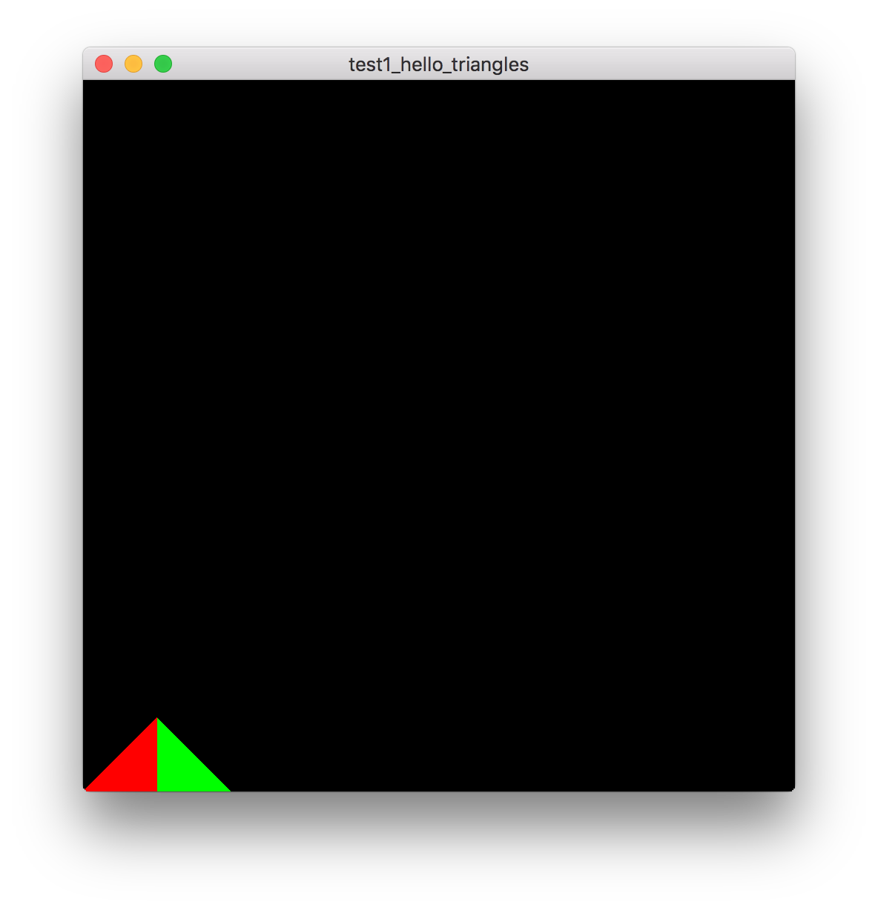

# 你好，三角形

- 英文原版：http://www.learnopengl.com/#!Getting-started/Hello-Triangle

- 中文版：https://learnopengl-cn.github.io/01%20Getting%20started/04%20Hello%20Triangle/

# 效果

# 关键字

- 顶点数组对象：Vertex Array Object，VAO

- 顶点缓冲对象：Vertex Buffer Object，VBO

- 索引缓冲对象：Element Buffer Object，EBO或Index Buffer Object，IBO

- 顶点着色器：Vertex Shader

- 片段着色器：Fragment Shader
