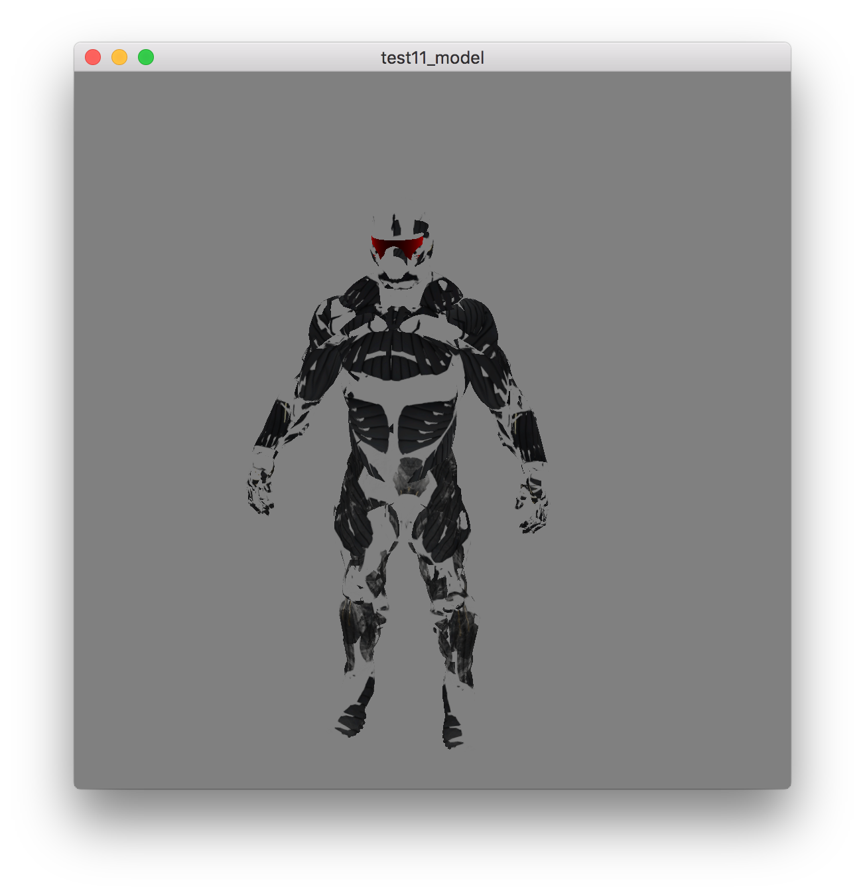

# 模型

## 参考教程

- 英文原版：http://learnopengl.com/#!Model-Loading/Model

- 中文版：https://learnopengl-cn.github.io/03%20Model%20Loading/03%20Model/

## 效果

## 关键字

- [Assimp（Open-Asset-Importer-Lib）](http://assimp.org/)：开放资源导入库

- [多边形网格（Polygon Mesh）](https://en.wikipedia.org/wiki/Polygon_mesh)

- [Wavefront .obj file](https://en.wikipedia.org/wiki/Wavefront_.obj_file)
