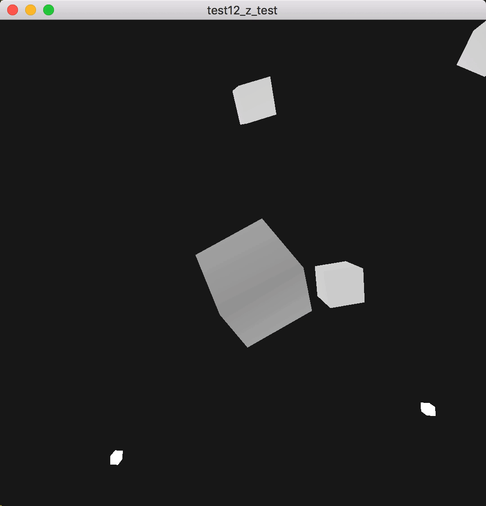

# 深度测试

## 参考教程

- 英文原版：http://learnopengl.com/#!Advanced-OpenGL/Depth-testing

- 中文版：https://learnopengl-cn.github.io/04%20Advanced%20OpenGL/01%20Depth%20testing/

## 效果

## 关键字

- [深度缓冲（Depth Buffer）](https://zh.wikipedia.org/wiki/%E6%B7%B1%E5%BA%A6%E7%BC%93%E5%86%B2)

- 深度测试函数

- 深度冲突
