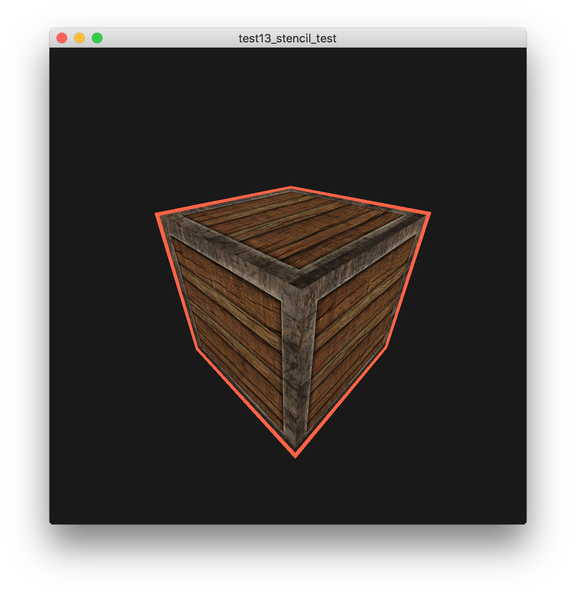

# 模板测试

## 参考教程

- 英文原版：http://learnopengl.com/#!Advanced-OpenGL/Stencil-testing

- 中文版：https://learnopengl-cn.github.io/04%20Advanced%20OpenGL/02%20Stencil%20testing/

## 效果

## 关键字

- 模板缓冲（Stencil Buffer）

- 模板函数

