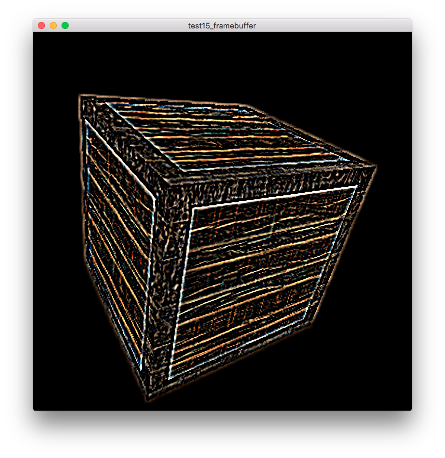

# 帧缓冲

## 参考教程

- 英文原版：http://learnopengl.com/#!Advanced-OpenGL/Framebuffers

- 中文版：https://learnopengl-cn.github.io/04%20Advanced%20OpenGL/05%20Framebuffers/

## 效果

## 关键字

- 后处理（Post-processing）
