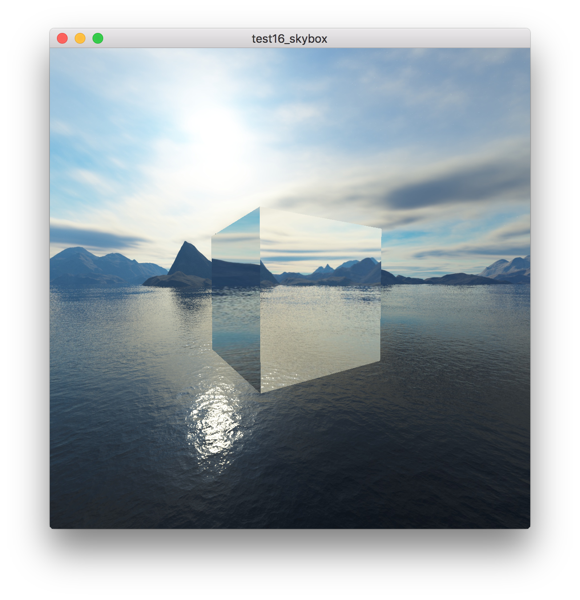

# 立方体贴图

## 参考教程

- 英文原版：http://learnopengl.com/#!Advanced-OpenGL/Cubemaps

- 中文版：https://learnopengl-cn.github.io/04%20Advanced%20OpenGL/06%20Cubemaps/

## 效果

## 关键字

- 立方体贴图（Cube Map）

- 天空盒（Sky Box）

- 环境映射（Environment Mapping）

- 动态环境映射（Dynamic Environment Mapping）

