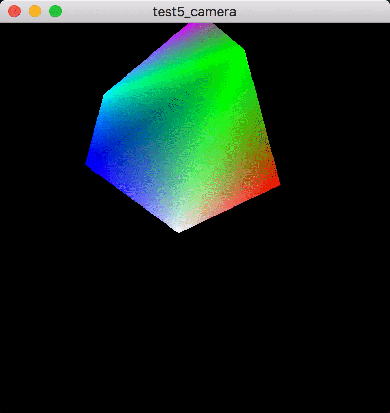
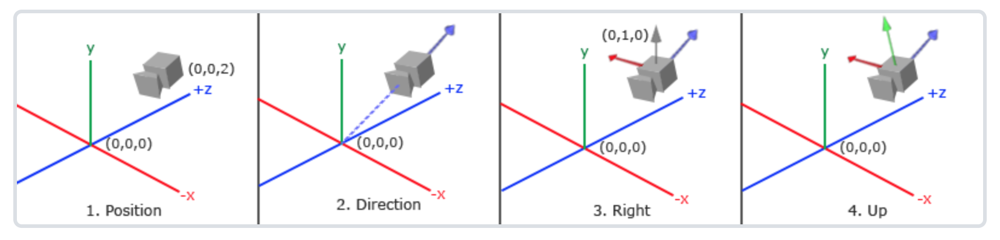
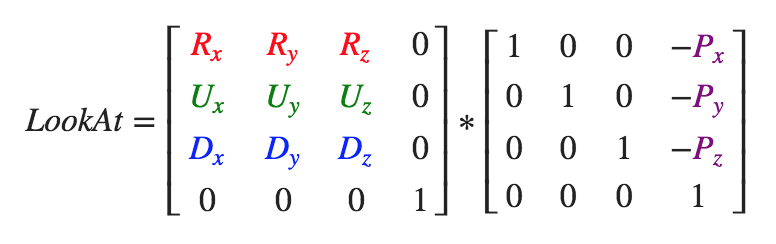

# 摄像机

## 参考教程

- 英文原版：http://learnopengl.com/#!Getting-started/Camera

- 中文版：https://learnopengl-cn.github.io/01%20Getting%20started/09%20Camera/

## 效果

## 关键字
- 观察空间（View Space）

    

- Look At 矩阵

    

    其中：

    - R 是**摄像机右向量**
    - U 是**摄像机上向量**
    - D 是**摄像机方向**
    - P 是**摄像机位置**

- [欧拉角](https://zh.wikipedia.org/zh-hans/%E6%AC%A7%E6%8B%89%E8%A7%92)

    - 俯仰角（Pitch）

    - 偏航角（Yaw）

    - 滚转角（Row）

## 说明
- [未封装成 Camera 类对应代码](https://github.com/yangruihan/OpenGL_study/tree/master/OpenGL_study/src/test/test5/test5.cpp)

- [封装 Camera 类对应代码](https://github.com/yangruihan/OpenGL_study/tree/master/OpenGL_study/src/test/test5/test5_use_camera.cpp)
