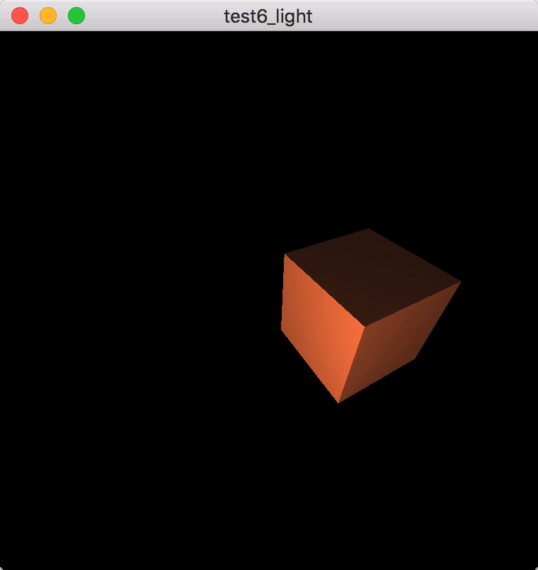

# 基础光照

## 参考教程

- 英文原版：http://learnopengl.com/#!Lighting/Basic-Lighting

- 中文版：https://learnopengl-cn.github.io/02%20Lighting/02%20Basic%20Lighting/

## 效果

## 关键字

- [冯氏光照模型（Phong Lighting Model）](https://en.wikipedia.org/wiki/Phong_reflection_model)

    

    - **环境光照(Ambient Lighting)**：即使在黑暗的情况下，世界上通常也仍然有一些光亮（月亮、远处的光），所以物体几乎永远不会是完全黑暗的。为了模拟这个，我们会使用一个环境光照常量，它永远会给物体一些颜色。

    - **漫反射光照(Diffuse Lighting)**：模拟光源对物体的方向性影响(Directional Impact)。它是冯氏光照模型中视觉上最显著的分量。物体的某一部分越是正对着光源，它就会越亮。

    - **镜面光照(Specular Lighting)**：模拟有光泽物体上面出现的亮点。镜面光照的颜色相比于物体的颜色会更倾向于光的颜色。
