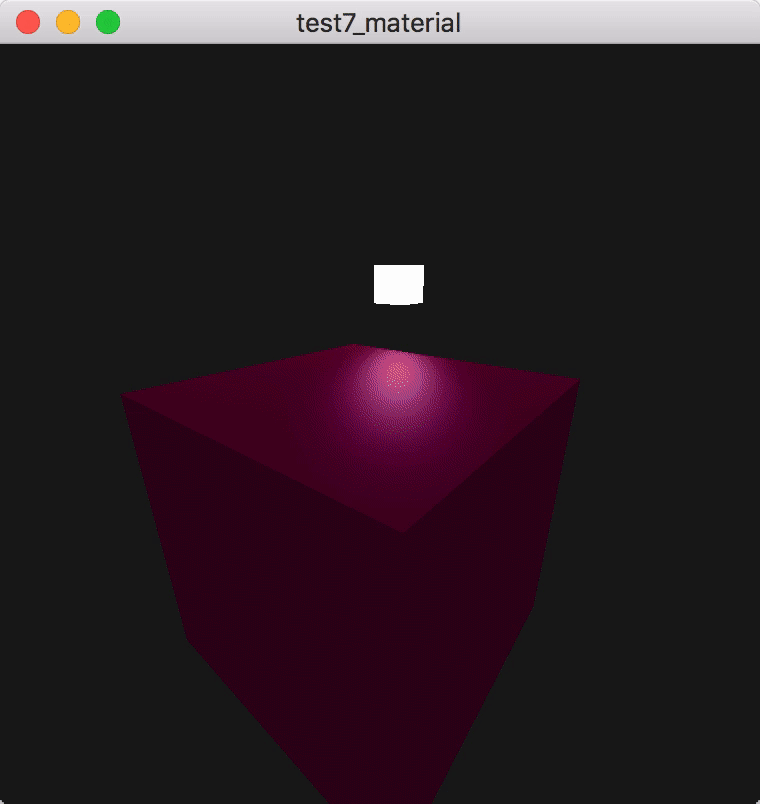

# 材质

## 参考教程

- 英文原版：http://learnopengl.com/#!Lighting/Materials

- 中文版：https://learnopengl-cn.github.io/02%20Lighting/03%20Materials/

## 效果

## 补充

- [这里](http://devernay.free.fr/cours/opengl/materials.html)展示了几种材质属性，模拟了现实世界中的真实材质（可能需要翻墙）