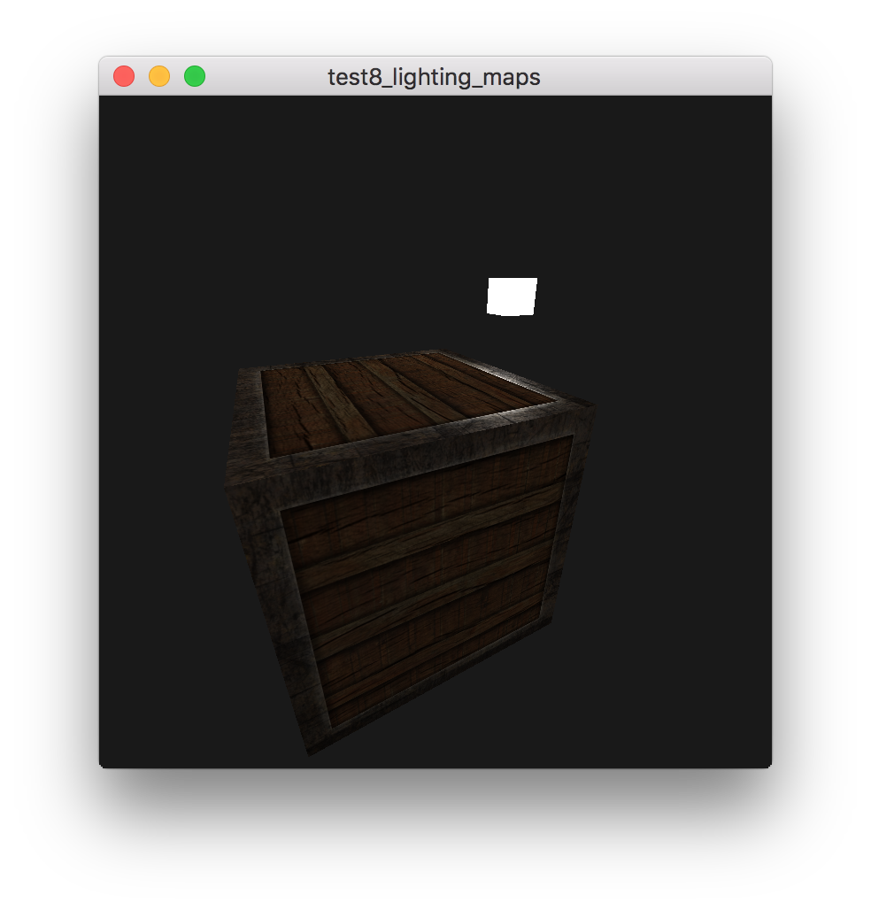

# 材质

## 参考教程

- 英文原版：http://learnopengl.com/#!Lighting/Lighting-maps

- 中文版：https://learnopengl-cn.github.io/02%20Lighting/04%20Lighting%20maps/

## 效果

## 关键字

- 漫反射贴图（Diffuse Map）

- 镜面光贴图（Specular Map）
