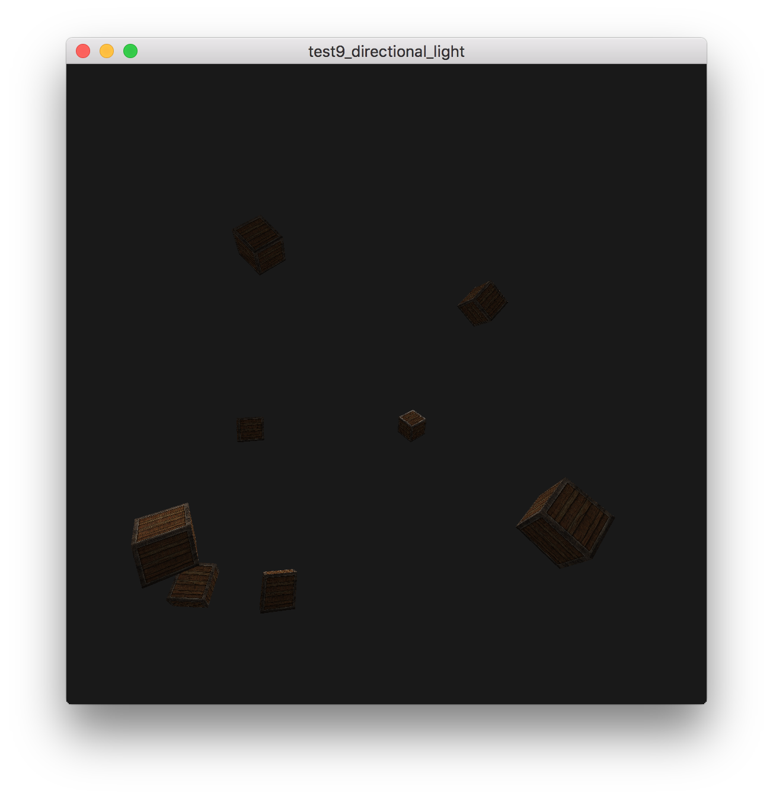
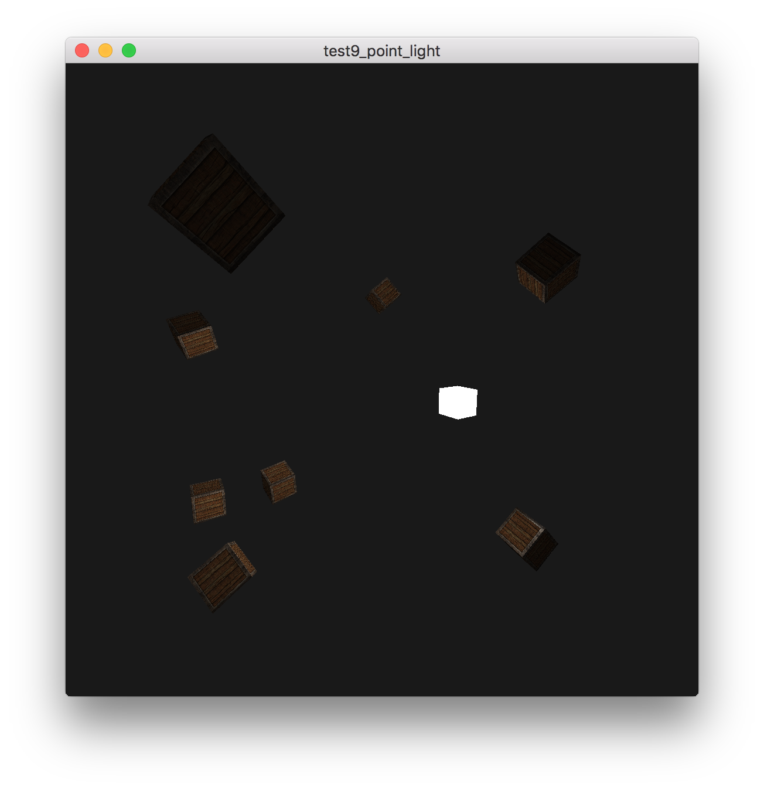
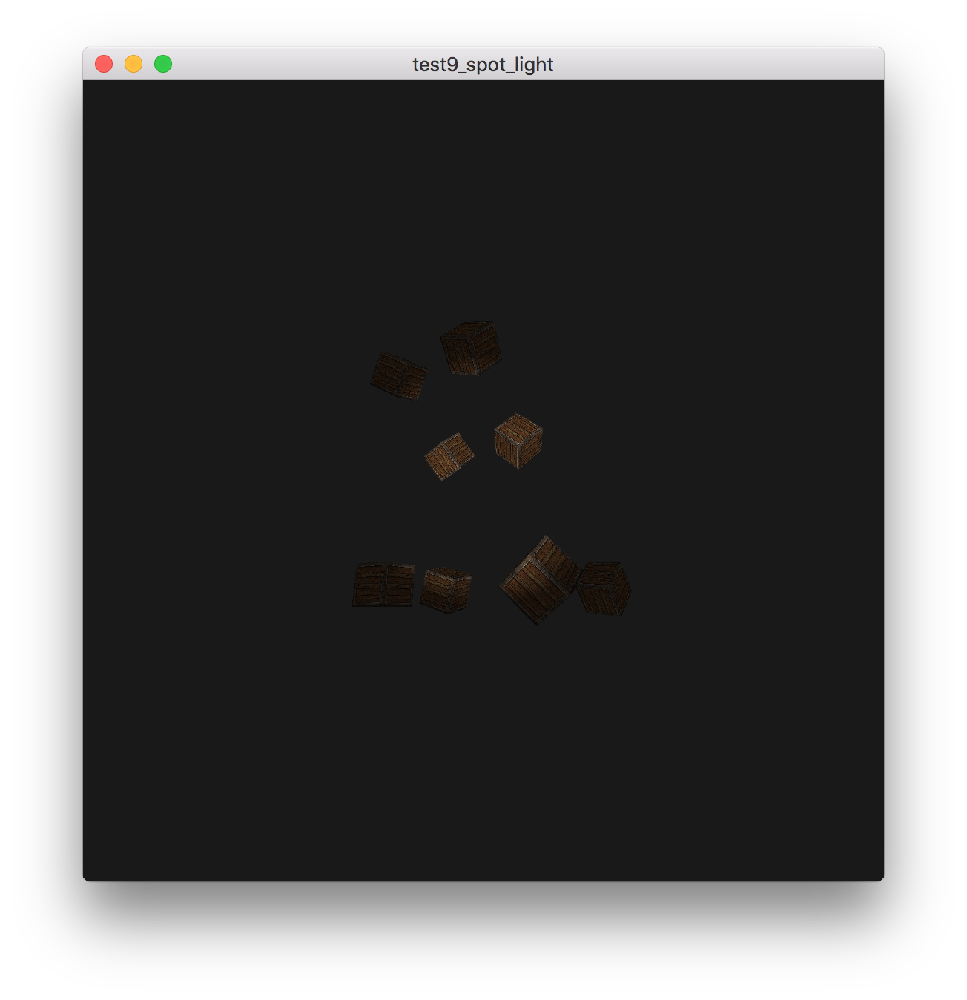

# 投光物

## 参考教程

- 英文原版：http://www.learnopengl.com/#!Lighting/Light-casters

- 中文版：https://learnopengl-cn.github.io/02%20Lighting/05%20Light%20casters/

## 效果

- 平行光（Directional light）

    

- 点光源（Point light）

    

- 聚光（Spot light）

    
