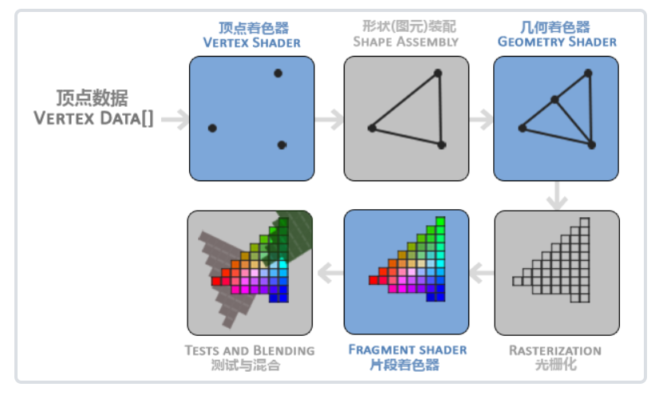
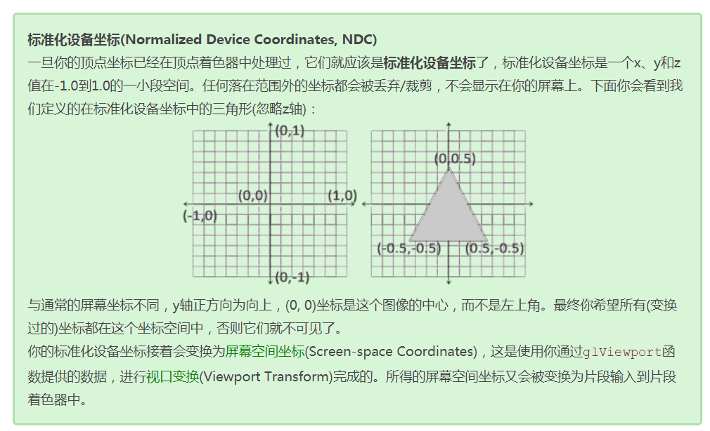

# OpenGL Study

A repository for OpenGL studying.

- 原教程地址：https://learnopengl.com/
- 中文教程地址：https://learnopengl-cn.github.io/

# 笔记
## 图形渲染管线（Graphics Pipeline）

指的是一堆原始图形数据途径一个输送管道，期间经过各种变化处理，最终出现在屏幕的过程

可以被划分为两个主要部分：

1. 3D坐标 -> 2D坐标
2. 2D坐标 -> 有颜色的像素

流程如下图所示：

## 标准化设备坐标（Normalized Device Coordinates，NDC）

